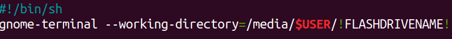
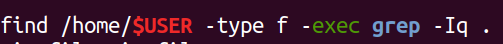
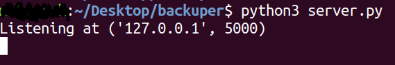
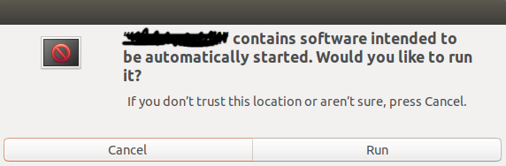

# backuper

### Requirements

To send files from your /* dir, copy all files from backuper to your flash-drive. Change *!FLASHDRIVENAME!* in autorun.sh file on yours.

Choose the sarch path in imps.sh .

To simulate sending files you can use server.py from this repository. Just copy this file into your machine and in terminal type python3 server.py.

## Usage

**Before read Usage please get acquainted with Requirments.** :alien: 
Plug flash-drive into your USB port. You should see prompt window with two options [RUN, CANCEL] 

Click on run. New terminal window should pop out and your current dir should be **/home/YOUR_USER_NAME/YOUR_FLASH_DRIVE_NAME**.
Type ./imps.sh *'HOST' 'PORT'*, if you use server from this repository on your local machine just type 127.0.0.1 5000.
In directory where server.py is you should see new file 'fetched_d.zip which contains all non-binary files from *your*:ghost: machine. :tada: 

## Built With

* **Python 3.6.7**
* **Ubuntu 18.04**

## Authors

* **Bartosz Brewczyński** 

## Sources

* *Brandon Rhodes, John Goerzen - Foundations of Python Network Programming, 3rd Edition*
* *The Linux Command Line: A Complete Introduction 1st Edition William E. Shotts Jr.*
